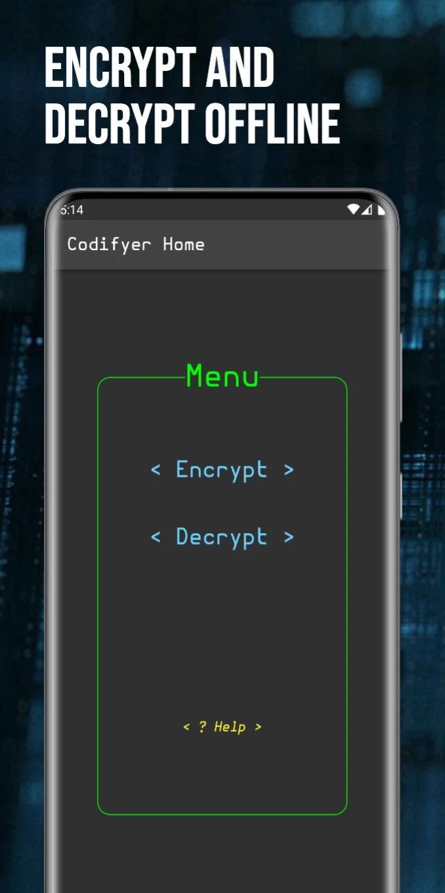
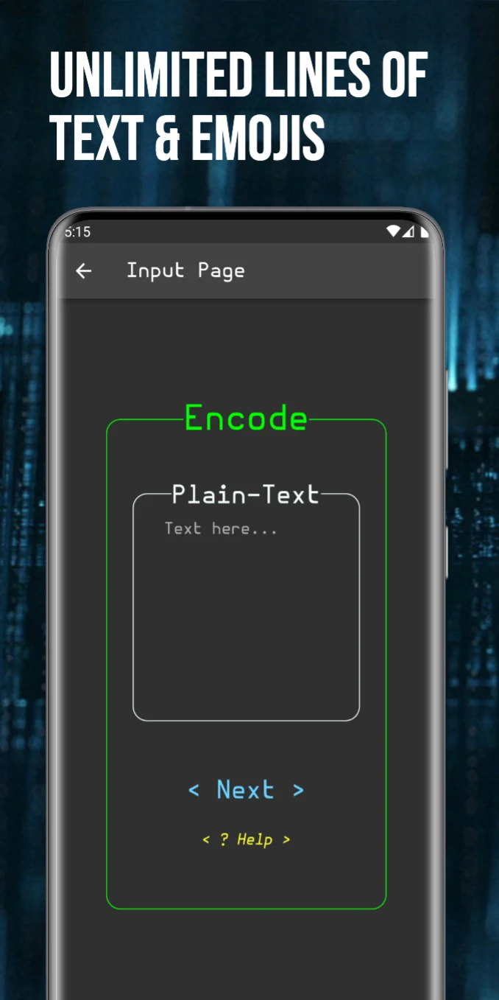
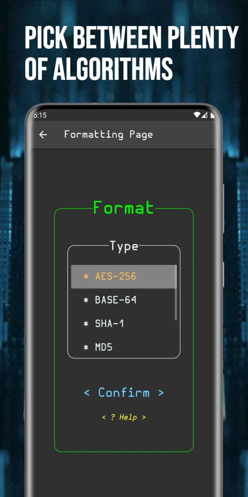
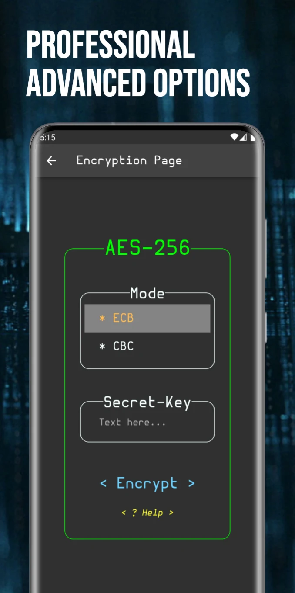
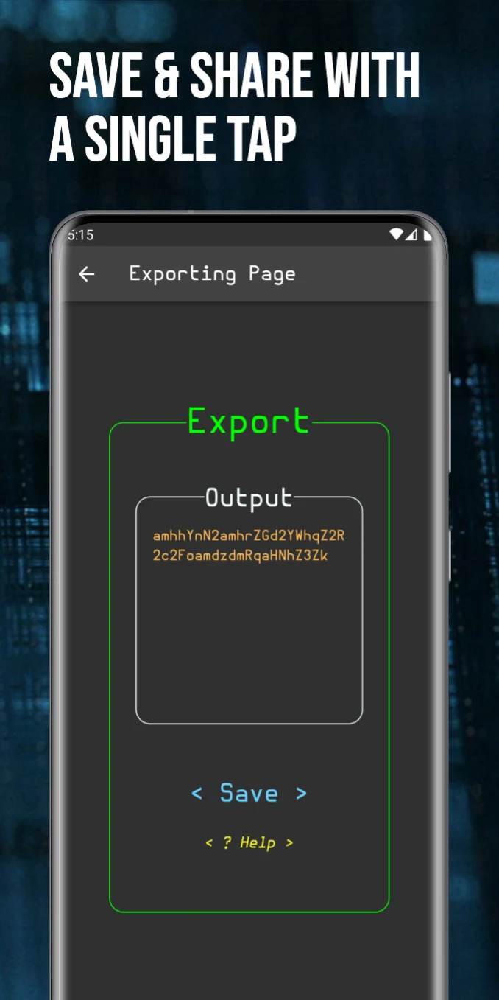

# Codifyer

Codifyer is a minimal but powerful encryption and decryption tool, useful for encrypting, encoding and hashing. It is totally free of charge.

## Preview
A little app preview
 

## Getting Started

#### *** Encryption formats supported ***
- AES-256 (ECB or CBC)
- Base-64
- SHA-1
- MD5
- Binary (Base-2)
- Hexadecimal (Base-16)

#### *** Supported decryption formats ***
- AES-256 (ECB or CBC)
- Base-64
- Binary (Base-2)
- Hexadecimal (Base-16)

#### *** FaQ ***
- "Why are there fewer decryption formats than encryption formats?"
Some of them, like SHA-1 and MD5, are hashing formats and because of the way they are designed, they cannot be decrypted conventionally.
- "Why does it raise a 'parameters' error when I try to encrypt my text in AES-256? "
The written key/password must be 16 or 32 characters long.
- "Why does it raise an 'input' error when I try to decrypt my ciphertext? "
The written input may be the wrong format or incomplete

## Installing and running

The app is currently available on the [Google Play Store](https://play.google.com/store/apps/details?id=com.dipasquale_alessandro.flutter_codify)
but you can compile it by yourself on iOS too, following this [Guide iOS](https://docs.flutter.dev/deployment/ios).
If you want to compile the app by yourself on Android, consider the following [Guide Android](https://docs.flutter.dev/deployment/android).

## Help
Feel free to open an issue in the relative section.

## Contributing
Pull requests are welcome. For major changes, please open an issue first to discuss what you would like to change.
Please make sure to update tests as appropriate.

## Authors
Alessandro Di Pasquale 
Developer's accounts:
- [GitHub - AleDipa](https://github.com/aledipa)
- [GitLab - AleDipa](https://gitlab.com/AleDipa)

## Version History

* 0.1
    * Initial Release
    * See [commit change](https://github.com/aledipa/Codifyer/commits/main) or See [release history](https://github.com/aledipa/Codifyer/releases/)

## Notes
The app is available on the Googler Play Store too, maybe i will publish it on the Apple App Store in the future.
